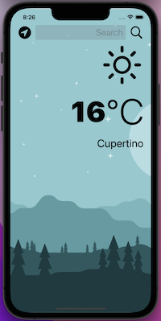

#  Clima

<h4 align="center">A iOS simple iOS weather app</h4>

  •<a href="#key-features">Key Features</a>
  •<a href="#how-to-use">How To Use</a> 

## Code Quality Status
 
 
 
 
  

## Key Features

* UIKit
* MVC
* Structs
* Classes and inheritance
* Optionals
* Dark mode
* Protocols
* Delegates
* Extensions
* Closures
* APIs
* JSON Parsing
* Core Location
* Error handling

## How To Use
With this simple app, you can know the weather in a city that you input in the text field, or you can press the location button, to get the weather in your current location.